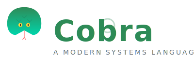

<p align="center">
  
</p>

# Cobra Programming Language

**The Python-inspired language with C-level performance.**

Cobra is a modern, systems-level programming language that combines the simplicity and readability of Python with the raw performance of C.

```cobra
fn main() {
    println("Hello, World!")
}
```

## Features

- **Pythonic Syntax** — Clean, indentation-based syntax
- **Native Compilation** — Compiled directly to x86-64 native executables
- **Static Typing** — With full type inference
- **FFI Support** — Call C libraries via `extern fn`, auto-bridge Python/Rust packages via `use python` / `use cargo`
- **Built-in Package Manager** — `cobra new`, `build`, `run`, `test`, and more
- **Cross-Platform** — macOS and Linux support
- **VS Code Extension** — Syntax highlighting, snippets, language support

## Quick Start

### Install via Homebrew

```bash
brew install Xznder1984/cobra/cobra
```

### Install via Script

```bash
curl -fsSL https://raw.githubusercontent.com/Xznder1984/Cobra/main/install.sh | sh
```

### Or Build from Source

```bash
git clone https://github.com/Xznder1984/Cobra.git
cd Cobra
make build
sudo make install
```

### Create a Project

```bash
cobra new myproject
cd myproject
cobra run
```

### Hello World

```cobra
// hello.cb
fn main() {
    println("Hello, World!")
}
```

```bash
cobra build
./build/program
```

## CLI Commands

| Command | Description |
|---------|-------------|
| `cobra new` | Create a new project |
| `cobra init` | Initialize a project |
| `cobra build` | Build the project |
| `cobra run` | Build and run |
| `cobra test` | Run tests |
| `cobra clean` | Clean artifacts |
| `cobra check` | Check for errors |
| `cobra fmt` | Format code |
| `cobra lint` | Lint code |
| `cobra docs` | Generate docs |
| `cobra repl` | Interactive REPL |
| `cobra doctor` | System check |

## Status

Cobra is in early development. Working features:
- `print()`, `println()`, `print_int()`, `print_float()` built-ins
- `let` variables, `if`/`else`, `while` loops
- String, integer, boolean literals and binary ops
- `extern fn` FFI (C ABI)
- `use python <pkg>` — auto pip install + CPython bridge generation
- `use cargo <crate>` — auto cargo build + C ABI bridge generation
- `return` from functions

Not yet implemented: `let mut` reassignment, `for` loops, user-defined function calls, structs, classes, arrays, lists, dicts, `break`/`continue`.

## Project Structure

```
cobra/
├── compiler/        # Cobra compiler (C)
├── cli/             # Command-line interface
├── runtime/         # Runtime library (libcobra_runtime.a)
├── vscode-extension/ # VS Code extension
├── website/         # Official website
├── branding/        # Logos and branding
├── docs/            # Documentation
├── examples/        # Example projects
├── install.sh       # Installation script
└── Formula/         # Homebrew formula
```

## Documentation

Full documentation is available in the [docs](docs/) directory:
- [Getting Started](docs/getting-started.md)
- [Language Reference](docs/language.md)
- [Examples](examples/)

## VS Code Extension

Install the Cobra VS Code extension from the [GitHub Releases](https://github.com/Xznder1984/Cobra/releases) page.

## Contributing

Contributions are welcome! See the [roadmap](docs/roadmap.md) for planned features.

## License

MIT License — see [LICENSE](LICENSE) for details.

## Community

- [GitHub](https://github.com/Xznder1984/Cobra)
- Website: [https://xznder1984.github.io/Cobra/](https://xznder1984.github.io/Cobra/)
